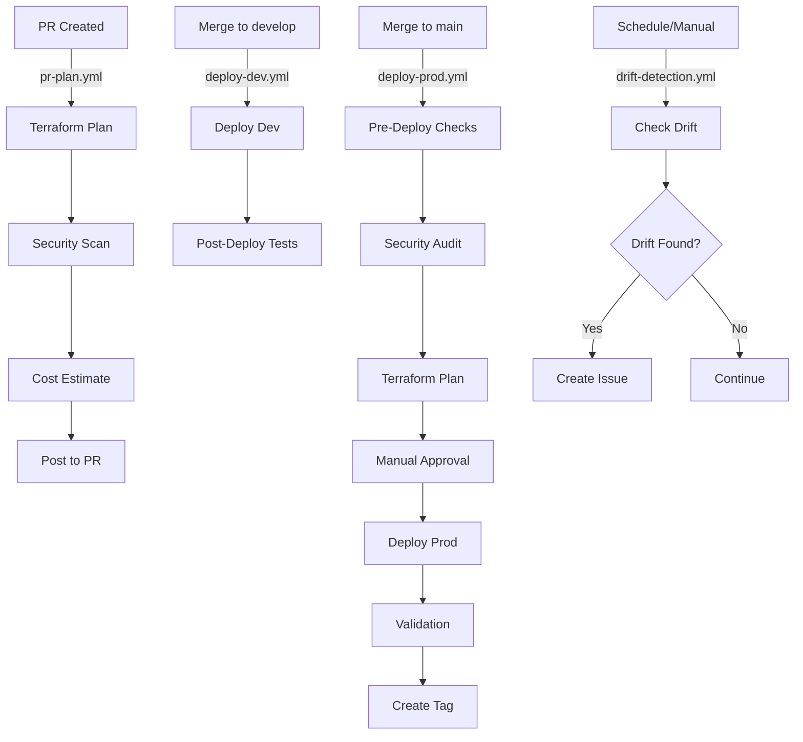

# GitHub Actions Workflows Documentation

## 📋 Overview

This repository includes a comprehensive set of reusable GitHub Actions workflows for managing AKS infrastructure with Terraform. The workflows follow enterprise best practices for security, cost management, and operational excellence.

## 🏗️ Workflow Architecture

```
.github/workflows/
├── terraform-reusable.yml    # Core reusable workflow
├── pr-plan.yml               # PR validation
├── deploy-dev.yml            # Development deployment
├── deploy-prod.yml           # Production deployment (with approvals)
├── manual-operations.yml     # Manual interventions
└── drift-detection.yml       # Scheduled drift detection
```

## 🔄 Workflow Files

### 1. terraform-reusable.yml (Core Reusable Workflow)

**Purpose:** Central workflow that all other workflows call. Handles the complete Terraform lifecycle.

**Features:**
- ✅ Terraform validation and formatting checks
- 🔒 Security scanning (tfsec, Checkov)
- 💰 Cost estimation (Infracost)
- 📊 Plan generation and approval
- 🚀 Apply/Destroy operations
- 📝 Comprehensive logging and summaries

**Inputs:**
| Input | Description | Required | Default |
|-------|-------------|----------|---------|
| `environment` | Target environment (dev/staging/prod) | Yes | - |
| `terraform_version` | Terraform version | No | 1.6.0 |
| `var_file` | Variable file path | No | '' |
| `terraform_action` | Action (plan/apply/destroy) | Yes | - |
| `auto_approve` | Auto-approve changes | No | false |
| `enable_checkov` | Enable Checkov scanning | No | true |
| `enable_tfsec` | Enable tfsec scanning | No | true |
| `enable_infracost` | Enable cost estimation | No | true |

**Secrets Required:**
- `AZURE_CLIENT_ID`
- `AZURE_CLIENT_SECRET`
- `AZURE_SUBSCRIPTION_ID`
- `AZURE_TENANT_ID`
- `INFRACOST_API_KEY` (optional)

**Jobs:**
1. **terraform-validate** - Format and validation checks
2. **security-scan** - Run security scanning tools
3. **terraform-plan** - Generate execution plan
4. **cost-estimate** - Estimate infrastructure costs
5. **terraform-apply** - Apply changes
6. **terraform-destroy** - Destroy infrastructure

### 2. pr-plan.yml (Pull Request Validation)

**Purpose:** Automatically runs Terraform plan on pull requests to validate changes.

**Triggers:**
- Pull requests to `main` or `develop` branches
- Changes to `.tf`, `.tfvars`, or workflow files

**Features:**
- 🔍 Detects which environments are affected
- 📋 Runs plan for each affected environment
- 💬 Posts plan results as PR comments
- 🔒 Security scanning on all PRs
- 💰 Cost impact analysis

**Example:**
```yaml
# Automatically triggered on PR
# No manual intervention needed
```

### 3. deploy-dev.yml (Development Deployment)

**Purpose:** Automatically deploys to development on merge to `develop` branch.

**Triggers:**
- Push to `develop` branch
- Manual trigger with workflow_dispatch

**Features:**
- 🚀 Automatic deployment (auto-approve)
- ✅ Post-deployment validation
- 🧪 Smoke tests
- 📊 Health checks

**Manual Trigger:**
```bash
# Via GitHub UI: Actions → Deploy to Development → Run workflow
# Select action: plan, apply, or destroy
```

### 4. deploy-prod.yml (Production Deployment)

**Purpose:** Controlled production deployment with multiple safeguards.

**Triggers:**
- Push to `main` branch (plan only)
- Manual trigger with workflow_dispatch

**Features:**
- 🛡️ Pre-deployment security checks
- 🔒 Production validation rules
- 👥 Manual approval required
- ✅ Comprehensive post-deployment validation
- 🏷️ Automatic deployment tagging
- 📢 Deployment notifications

**Deployment Flow:**
```
Pre-Deployment Checks
    ↓
Security Audit
    ↓
Terraform Plan
    ↓
Manual Approval (Required)
    ↓
Terraform Apply
    ↓
Post-Deployment Validation
    ↓
Create Git Tag
    ↓
Send Notifications
```

**Manual Trigger:**
```bash
# Via GitHub UI: Actions → Deploy to Production → Run workflow
# 1. Select action (plan/apply/destroy)
# 2. Review plan output
# 3. Approve in Environments UI
# 4. Deployment proceeds
```

### 5. manual-operations.yml (Manual Operations)

**Purpose:** Perform ad-hoc Terraform operations on any environment.

**Triggers:**
- Manual workflow_dispatch only

**Operations:**
- `plan` - Generate execution plan
- `apply` - Apply changes
- `destroy` - Destroy infrastructure
- `validate` - Validate configuration
- `refresh-state` - Refresh Terraform state

**Features:**
- 🔒 Destroy confirmation required (must type "DESTROY")
- 🚨 Production destroy warnings
- 📝 Audit logging
- 🔐 Environment-specific controls

**Usage:**
```bash
# Via GitHub UI: Actions → Manual Operations → Run workflow
# 1. Select environment (dev/staging/prod)
# 2. Select operation
# 3. For destroy: type "DESTROY" in confirmation
```

### 6. drift-detection.yml (Drift Detection)

**Purpose:** Detect configuration drift between Terraform code and actual infrastructure.

**Triggers:**
- Scheduled: Daily at 2 AM UTC
- Manual: workflow_dispatch

**Features:**
- 🔍 Automated drift detection
- 📊 Drift reports with artifacts
- 🎫 Automatic issue creation
- 🚨 Critical alerts for production drift
- 📅 Scheduled daily checks

**Outputs:**
- Drift reports (uploaded as artifacts)
- GitHub issues for detected drift
- Summary in Actions tab

**Manual Trigger:**
```bash
# Via GitHub UI: Actions → Drift Detection → Run workflow
# Select environment: all, dev, staging, or prod
```

## 🔐 Required Secrets Setup

### Azure Service Principal

Create a service principal with Contributor role:

```bash
# Create service principal
az ad sp create-for-rbac \
  --name "terraform-aks-sp" \
  --role Contributor \
  --scopes /subscriptions/YOUR_SUBSCRIPTION_ID \
  --sdk-auth

# Copy the JSON output
```

### GitHub Secrets

Navigate to: **Settings → Secrets and variables → Actions → New repository secret**

Add the following secrets:

| Secret Name | Description | Required |
|-------------|-------------|----------|
| `AZURE_CLIENT_ID` | Service principal App ID | Yes |
| `AZURE_CLIENT_SECRET` | Service principal password | Yes |
| `AZURE_SUBSCRIPTION_ID` | Azure subscription ID | Yes |
| `AZURE_TENANT_ID` | Azure tenant ID | Yes |
| `AZURE_CREDENTIALS` | Full JSON output from az ad sp create | Yes |
| `INFRACOST_API_KEY` | Infracost API key | Optional |

### Get Infracost API Key (Optional)

```bash
# Sign up at https://www.infracost.io/
# Get API key from dashboard
```

## 🌍 Environment Configuration

### GitHub Environments Setup

Create the following environments in **Settings → Environments**:

#### 1. dev
- **Protection rules:** None (automatic deployment)
- **Secrets:** Environment-specific if needed
- **Reviewers:** Not required

#### 2. staging
- **Protection rules:** Optional reviewers
- **Secrets:** Environment-specific if needed
- **Reviewers:** 1+ team members

#### 3. prod
- **Protection rules:** 
  - Required reviewers: 2+ team members
  - Wait timer: 5 minutes (optional)
  - Limit branches: `main` only
- **Secrets:** Production-specific
- **Reviewers:** Senior engineers/platform team

#### 4. prod-approval (for manual approval)
- **Protection rules:**
  - Required reviewers: 2+ senior team members
- **Purpose:** Extra approval gate for production

#### 5. dev-destroy, staging-destroy, prod-destroy
- **Protection rules:** Require approval for destroy operations
- **Purpose:** Prevent accidental infrastructure deletion

## 📊 Workflow Outputs

### Artifacts

Each workflow generates artifacts that are stored for specific retention periods:

| Artifact | Retention | Description |
|----------|-----------|-------------|
| `tfplan-{env}-{run}` | 5 days | Terraform plan file |
| `plan-output-{env}-{run}` | 5 days | Plan text output |
| `terraform-outputs-{env}-{run}` | 30 days | Terraform outputs JSON |
| `drift-report-{env}` | 30-90 days | Drift detection reports |

### Job Summaries

All workflows generate comprehensive summaries in the GitHub Actions UI:

- ✅ Validation results
- 🔒 Security scan findings
- 💰 Cost estimates
- 📋 Plan summaries
- ✅ Deployment status
- 🔍 Post-deployment validation

## 🚀 Usage Examples

### Example 1: Deploy to Development

```yaml
# Automatic on merge to develop branch
git checkout develop
git merge feature-branch
git push origin develop
# Workflow automatically runs and deploys
```

### Example 2: Plan Production Changes

```yaml
# Via GitHub UI
Actions → Deploy to Production → Run workflow
- Select: plan
- Click "Run workflow"
# Review plan in Actions tab
```

### Example 3: Apply Production Changes

```yaml
# After reviewing plan
Actions → Deploy to Production → Run workflow
- Select: apply
- Click "Run workflow"
# Approve in Environments tab when prompted
# Deployment proceeds after approval
```

### Example 4: Emergency Manual Operation

```yaml
# Via GitHub UI
Actions → Manual Operations → Run workflow
- Environment: prod
- Operation: plan
- Click "Run workflow"
# Review results before applying
```

### Example 5: Check for Drift

```yaml
# Via GitHub UI
Actions → Drift Detection → Run workflow
- Environment: all
- Click "Run workflow"
# Check for any issues created
```

## 🔧 Customization

### Modify Terraform Version

Edit the workflow call:

```yaml
terraform_version: '1.7.0'  # Update version
```

### Add Custom Validations

Add steps to `deploy-prod.yml`:

```yaml
- name: Custom Validation
  run: |
    # Your custom validation logic
    ./scripts/validate-prod.sh
```

### Configure Notifications

Add notification steps to workflows:

```yaml
- name: Send Slack Notification
  uses: slackapi/slack-github-action@v1
  with:
    webhook-url: ${{ secrets.SLACK_WEBHOOK }}
    payload: |
      {
        "text": "Deployment completed: ${{ github.event.repository.name }}"
      }
```

### Modify Security Scanning

Disable specific scans:

```yaml
enable_checkov: false
enable_tfsec: false
```

Or configure custom rules in `.tfsec` and `.checkov` directories.

## 📈 Best Practices

### 1. Branch Strategy

```
main (production)
  ↑
  merge after approval
  ↑
develop (staging/dev)
  ↑
  merge after review
  ↑
feature branches
```

### 2. Approval Process

- **Development:** Automatic deployment
- **Staging:** 1+ reviewer required
- **Production:** 2+ reviewers required + manual approval

### 3. State Management

- Use Azure Storage backend (configured in `main.tf`)
- Enable state locking
- Regular state backups

### 4. Security

- ✅ All secrets in GitHub Secrets
- ✅ Service principal with minimal permissions
- ✅ Security scanning on every PR
- ✅ Drift detection enabled
- ✅ Audit logs maintained

### 5. Cost Control

- 💰 Cost estimates on every plan
- 📊 Review Infracost reports
- 🔍 Regular cost reviews
- 🎯 Set budget alerts in Azure

## 🔍 Troubleshooting

### Common Issues

#### 1. Authentication Failures

```bash
# Verify secrets are set correctly
# Check service principal hasn't expired
az ad sp show --id YOUR_CLIENT_ID
```

#### 2. Plan Failures

```bash
# Check Terraform syntax
terraform validate

# Verify backend configuration
terraform init
```

#### 3. Approval Not Showing

```bash
# Ensure environments are configured
# Settings → Environments → {env} → Protection rules
```

#### 4. Drift Detection False Positives

```yaml
# Some resources have expected drift (auto-scaling)
# Review and update Terraform code to match
# Or add lifecycle rules to ignore_changes
```

### Debug Mode

Enable debug logging:

```yaml
env:
  TF_LOG: DEBUG
  ACTIONS_STEP_DEBUG: true
```

## 📚 Additional Resources

- [Terraform GitHub Actions](https://github.com/hashicorp/setup-terraform)
- [Azure Login Action](https://github.com/Azure/login)
- [Infracost GitHub Action](https://github.com/infracost/actions)
- [tfsec](https://aquasecurity.github.io/tfsec/)
- [Checkov](https://www.checkov.io/)

## 🤝 Contributing

1. Create feature branch from `develop`
2. Make changes
3. Create PR to `develop`
4. Workflows automatically validate
5. After approval, merge to `develop`
6. For production, create PR from `develop` to `main`

## 📝 Workflow Diagram



---

**Last Updated:** December 2024  
**Workflow Version:** 1.0.0  
**Terraform Version:** 1.6.0+
