# AKS Terraform Infrastructure

Production-ready, modular Terraform configuration for Azure Kubernetes Service (AKS) with security best practices and enterprise-grade features.

## 🏗️ Architecture

### Infrastructure Flow

```mermaid
flowchart TB
    subgraph INIT["1 · Terraform Init"]
        BE[Azure Storage Backend<br/>terraform-state-rg / tfstateaksproject]
    end

    subgraph ROOT["2 · Root Module"]
        RG["Resource Group<br/>{project}-{env}-rg"]
        LAW["Log Analytics Workspace<br/>{project}-{env}-law<br/>30-day retention"]
    end

    subgraph NET["3 · Networking Module"]
        VNET["Virtual Network<br/>{project}-{env}-vnet<br/>10.0.0.0/16"]
        SUB["AKS Subnet<br/>{project}-{env}-aks-subnet<br/>10.0.1.0/24"]
        NSG["Network Security Group<br/>Allow HTTPS · Deny All"]
    end

    subgraph AKS["4 · AKS Module"]
        MI["User-Assigned<br/>Managed Identity"]
        CLUSTER["AKS Cluster<br/>{project}-{env}-aks"]
        DIAG["Diagnostic Settings<br/>API Server · Audit · Scheduler"]
    end

    subgraph SEC["Security & Add-ons"]
        AAD["Azure AD / RBAC"]
        DEF["Microsoft Defender"]
        KV["Key Vault<br/>Secrets Provider"]
        POL["Azure Policy"]
        WI["Workload Identity<br/>OIDC Issuer"]
    end

    BE --> RG
    RG --> LAW
    RG --> VNET
    VNET --> SUB
    SUB --> NSG
    SUB --> MI
    MI --> CLUSTER
    LAW --> DIAG
    CLUSTER --> DIAG
    CLUSTER --> AAD
    CLUSTER --> DEF
    CLUSTER --> KV
    CLUSTER --> POL
    CLUSTER --> WI

    style INIT fill:#2d3748,color:#e2e8f0,stroke:#4a5568
    style ROOT fill:#1a365d,color:#bee3f8,stroke:#2b6cb0
    style NET  fill:#22543d,color:#c6f6d5,stroke:#2f855a
    style AKS  fill:#553c9a,color:#e9d8fd,stroke:#6b46c1
    style SEC  fill:#744210,color:#fefcbf,stroke:#b7791f
```



### CI/CD Pipeline Flow

```mermaid
flowchart LR
    subgraph PR["Pull Request"]
        LINT["fmt · validate<br/>tfsec · Checkov"]
        PLAN["terraform plan"]
        COST["Infracost<br/>Cost Estimate"]
    end

    subgraph DEV["Dev Deploy"]
        D_INIT["terraform init"]
        D_APPLY["terraform apply<br/>auto-approve"]
        D_VAL["Post-deploy<br/>Validation"]
    end

    subgraph PROD["Prod Deploy"]
        APPROVAL["Manual<br/>Approval Gate"]
        P_INIT["terraform init"]
        P_APPLY["terraform apply"]
        P_VAL["Post-deploy<br/>Validation"]
    end

    DRIFT["Scheduled<br/>Drift Detection<br/>Daily 2 AM UTC"]

    LINT --> PLAN --> COST
    COST -->|merge to develop| D_INIT --> D_APPLY --> D_VAL
    COST -->|merge to main| APPROVAL --> P_INIT --> P_APPLY --> P_VAL
    DRIFT -.->|reports drift| PLAN

    style PR   fill:#2d3748,color:#e2e8f0,stroke:#4a5568
    style DEV  fill:#22543d,color:#c6f6d5,stroke:#2f855a
    style PROD fill:#742a2a,color:#fed7d7,stroke:#c53030
    style DRIFT fill:#744210,color:#fefcbf,stroke:#b7791f
```



### Directory Structure

```
aks-terraform/
├── main.tf                      # Root module - orchestrates all resources
├── variables.tf                 # Input variables with validation
├── outputs.tf                   # Output values
├── terraform.tfvars.example     # Example variable values
├── modules/
│   ├── networking/              # VNet, Subnets, NSG
│   │   ├── main.tf
│   │   ├── variables.tf
│   │   └── outputs.tf
│   └── aks/                     # AKS cluster configuration
│       ├── main.tf
│       ├── variables.tf
│       └── outputs.tf
└── environments/
    └── prod.tfvars              # Production-specific values
```

## 🔒 Security Features

### Network Security
- **Private Cluster**: API server accessible only from private network
- **Azure CNI**: Native Azure networking with Network Security Groups
- **Network Policies**: Pod-to-pod traffic control using Azure Network Policy
- **NSG Rules**: Subnet-level network security

### Identity & Access Management
- **Azure AD Integration**: Managed Azure AD authentication
- **RBAC**: Kubernetes and Azure RBAC enabled
- **Managed Identities**: User-assigned identity for cluster operations
- **Workload Identity**: OIDC-based pod authentication (no service principals)
- **No Local Accounts**: Local admin account disabled

### Security Hardening
- **Microsoft Defender**: Container threat protection
- **Azure Policy**: Compliance enforcement at cluster level
- **Key Vault Secrets Provider**: Secure secret rotation
- **Run Command Disabled**: Prevents unauthorized command execution
- **Automatic Security Patches**: Channel-based automatic upgrades

### Monitoring & Auditing
- **Azure Monitor**: Container insights and metrics
- **Log Analytics**: Centralized logging (30-day retention)
- **Diagnostic Logs**: API server, audit, controller manager, scheduler
- **Microsoft Defender Logs**: Security event monitoring

## 📋 Prerequisites

1. **Azure CLI** (version 2.50+)
   ```bash
   az --version
   az login
   ```

2. **Terraform** (version 1.6+)
   ```bash
   terraform version
   ```

3. **Azure Subscription** with Contributor role

4. **Azure AD Admin Group** (optional but recommended)
   ```bash
   # Create an Azure AD group for cluster admins
   az ad group create --display-name "AKS-Admins" --mail-nickname "aks-admins"
   
   # Get the Object ID
   az ad group show --group "AKS-Admins" --query id -o tsv
   ```

## 🚀 Quick Start

### 1. Initialize Configuration

```bash
# Clone or create the directory structure
cd aks-terraform

# Copy example variables
cp terraform.tfvars.example terraform.tfvars

# Edit terraform.tfvars with your values
nano terraform.tfvars
```

### 2. Configure Remote State (Recommended)

```bash
# Create storage account for Terraform state
az group create --name terraform-state-rg --location eastus

az storage account create \
  --name tfstateaksproject \
  --resource-group terraform-state-rg \
  --location eastus \
  --sku Standard_LRS

az storage container create \
  --name tfstate \
  --account-name tfstateaksproject
```

The backend is configured in `main.tf`:
```hcl
backend "azurerm" {
  resource_group_name  = "terraform-state-rg"
  storage_account_name = "tfstateaksproject"
  container_name       = "tfstate"
  key                  = "aks/terraform.tfstate"
}
```

**Backend Authentication**: CI/CD workflows authenticate to the storage backend by fetching the storage account access key at runtime via `az storage account keys list`. The service principal needs **Contributor** role on the storage account resource group. See the [Drift Detection](#-drift-detection) section for details.

### 3. Deploy Infrastructure

```bash
# Initialize Terraform
terraform init

# Validate configuration
terraform validate

# Review execution plan
terraform plan

# Apply configuration
terraform apply
```

### 4. Access the Cluster

```bash
# Get AKS credentials
az aks get-credentials \
  --resource-group $(terraform output -raw resource_group_name) \
  --name $(terraform output -raw aks_cluster_name)

# Verify connection
kubectl get nodes
kubectl get namespaces
```

## 📊 Node Configuration

### Default Setup (2 Nodes)
- **VM Size**: Standard_D2s_v3 (2 vCPU, 8 GiB RAM)
- **OS Disk**: 128 GB managed premium SSD
- **Auto-scaling**: Enabled (2-4 nodes)
- **Max Pods**: 110 per node

### Production Recommendations
- **Dev/Test**: Standard_D2s_v3 (2-4 nodes)
- **Production**: Standard_D4s_v3 or higher (3-6+ nodes)
- **High Performance**: Standard_D8s_v3 or F-series

## 🔧 Configuration Variables

| Variable | Description | Default | Required |
|----------|-------------|---------|----------|
| `project_name` | Project identifier (max 10 chars) | - | Yes |
| `environment` | Environment (dev/staging/prod) | - | Yes |
| `location` | Azure region | eastus | No |
| `node_count` | Initial node count | 2 | No |
| `node_vm_size` | VM size for nodes | Standard_D2s_v3 | No |
| `enable_private_cluster` | Enable private cluster | true | No |
| `admin_group_object_ids` | Azure AD admin groups | [] | No |
| `kubernetes_version` | Kubernetes version | 1.28.3 | No |

## 🏷️ Resource Naming Convention

Resources follow the pattern: `{project_name}-{environment}-{resource_type}`

Examples:
- Resource Group: `myproject-prod-rg`
- AKS Cluster: `myproject-prod-aks`
- VNet: `myproject-prod-vnet`

## 🔐 Security Best Practices

### 1. Private Cluster
Always use `enable_private_cluster = true` for production:
- API server accessible only via private endpoint
- Requires VPN/ExpressRoute or jumpbox for management

### 2. Azure AD Integration
Configure admin groups for RBAC:
```hcl
admin_group_object_ids = [
  "xxxxxxxx-xxxx-xxxx-xxxx-xxxxxxxxxxxx"
]
```

### 3. Network Security
- Use Azure CNI for better network integration
- Implement Network Policies for pod-to-pod security
- Configure NSG rules based on your requirements

### 4. Secrets Management
- Use Key Vault Secrets Provider (enabled by default)
- Rotate secrets automatically (2-minute interval)
- Never commit secrets to version control

### 5. Monitoring
- Enable Azure Monitor and Log Analytics
- Configure alerts for critical metrics
- Review audit logs regularly

### 6. Updates & Patches
- Use automatic channel upgrades (`patch` mode)
- Schedule maintenance windows for updates
- Test upgrades in non-production first

## 🔄 CI/CD with GitHub Actions

This repository includes **production-ready reusable GitHub Actions workflows** for complete infrastructure automation.

### 🚀 Quick Setup

```bash
# 1. Install GitHub CLI
brew install gh  # or download from https://cli.github.com/

# 2. Authenticate
gh auth login

# 3. Run setup script
./scripts/setup-github-secrets.sh

# 4. Verify configuration
./scripts/verify-workflows.sh
```

### 📋 Included Workflows

| Workflow | Purpose | Trigger |
|----------|---------|---------|
| `terraform-reusable.yml` | Core reusable workflow | Called by other workflows |
| `pr-plan.yml` | Validate PRs with Terraform plan | Pull requests |
| `deploy-dev.yml` | Auto-deploy to development | Push to `develop` |
| `deploy-prod.yml` | Deploy to production (with approval) | Push to `main` or manual |
| `manual-operations.yml` | Manual Terraform operations | Manual only |
| `drift-detection.yml` | Daily drift detection | Scheduled + manual |

### 🔍 Drift Detection

The drift detection workflow runs daily at 2:00 AM UTC and can also be triggered manually for specific environments (dev, staging, prod, or all).

**How it works:**
1. Authenticates to Azure using the service principal credentials
2. Fetches the storage account access key via `az storage account keys list` and exports it as `ARM_ACCESS_KEY`
3. Runs `terraform init` and `terraform plan` with `-detailed-exitcode` to detect changes
4. Reports drift status per environment in the workflow summary

**Backend auth pattern** used across CI workflows:
```yaml
- name: Azure Login
  uses: azure/login@v2
  with:
    creds: '{"clientId":"...","clientSecret":"...","subscriptionId":"...","tenantId":"..."}'

- name: Get Storage Access Key
  run: |
    ACCESS_KEY=$(az storage account keys list \
      --resource-group terraform-state-rg \
      --account-name tfstateaksproject \
      --query '[0].value' -o tsv)
    echo "::add-mask::$ACCESS_KEY"
    echo "ARM_ACCESS_KEY=$ACCESS_KEY" >> $GITHUB_ENV
```

This approach uses management-plane access (Contributor role) to retrieve the storage key, then uses the key for data-plane blob operations. This avoids needing `Storage Blob Data Contributor` RBAC on the storage account.

### 🔐 Required Secrets

Set up in **Settings → Secrets and variables → Actions**:

- `AZURE_CLIENT_ID` - Service principal App ID
- `AZURE_CLIENT_SECRET` - Service principal password
- `AZURE_SUBSCRIPTION_ID` - Azure subscription ID
- `AZURE_TENANT_ID` - Azure tenant ID
- `AZURE_CREDENTIALS` - Full JSON credentials
- `INFRACOST_API_KEY` - Cost estimation (optional)

### 🌍 Environment Protection

Configure in **Settings → Environments**:

1. **dev** - No protection (auto-deploy)
2. **staging** - Optional reviewers
3. **prod** - 2+ required reviewers
4. **prod-approval** - Extra gate for production

### 📖 Full Documentation

For complete workflow documentation, see [GITHUB_ACTIONS_GUIDE.md](GITHUB_ACTIONS_GUIDE.md)

### ✨ Features

- ✅ Automated Terraform validation
- 🔒 Security scanning (tfsec, Checkov)
- 💰 Cost estimation (Infracost)
- 🔍 Drift detection
- 👥 Multi-environment support
- ✔️ Manual approvals for production
- 📊 Comprehensive reporting
- 🎯 Post-deployment validation

## 📈 Cost Optimization

1. **Use Autoscaling**: Configured by default (min=2, max=4)
2. **Right-size VMs**: Start with D2s_v3, scale as needed
3. **Spot Instances**: Consider for non-critical workloads
4. **Reserved Instances**: 1-3 year commitments for savings
5. **Monitoring**: Review Azure Advisor recommendations

### Estimated Monthly Costs
- **2x Standard_D2s_v3**: ~$140-160/month
- **2x Standard_D4s_v3**: ~$280-320/month
- **Log Analytics**: ~$2-10/month (based on ingestion)

## 🧪 Testing & Validation

```bash
# Validate Terraform syntax
terraform fmt -check
terraform validate

# Security scanning with tfsec
tfsec .

# Cost estimation with Infracost
infracost breakdown --path .

# Test cluster connectivity
kubectl cluster-info
kubectl get nodes -o wide
```

## 🔄 Upgrade Procedures

### Terraform Upgrade
```bash
terraform init -upgrade
terraform plan
terraform apply
```

### Kubernetes Version Upgrade
```bash
# Update kubernetes_version in terraform.tfvars
# Review the plan
terraform plan

# Apply the upgrade (during maintenance window)
terraform apply
```

## 🗑️ Cleanup

```bash
# Destroy all resources
terraform destroy

# Confirm when prompted
# WARNING: This will delete the entire cluster and all resources
```

## 📚 Additional Resources

- [AKS Best Practices](https://learn.microsoft.com/azure/aks/best-practices)
- [Azure Security Baseline for AKS](https://learn.microsoft.com/security/benchmark/azure/baselines/aks-security-baseline)
- [Terraform AKS Provider](https://registry.terraform.io/providers/hashicorp/azurerm/latest/docs/resources/kubernetes_cluster)
- [AKS Production Baseline](https://learn.microsoft.com/azure/architecture/reference-architectures/containers/aks/baseline-aks)

## 🤝 Contributing

1. Create feature branch
2. Make changes
3. Run `terraform fmt` and `terraform validate`
4. Test in development environment
5. Submit pull request

## 📝 License

This configuration is provided as-is for reference and customization.

## ⚠️ Important Notes

- **Private Cluster Access**: Requires VPN/ExpressRoute or Azure Bastion
- **State File Security**: Store backend state in Azure Storage with encryption
- **Cost Awareness**: Monitor Azure costs regularly
- **Backup**: Use Velero or Azure Backup for cluster backups
- **Disaster Recovery**: Test restore procedures regularly
